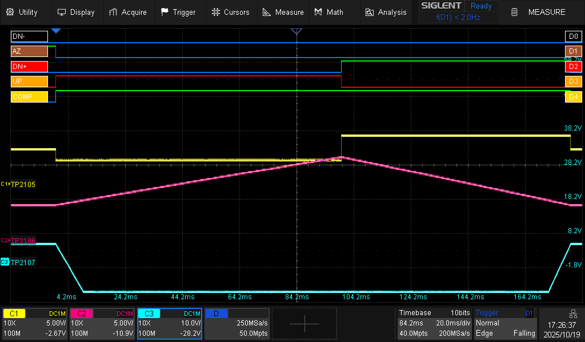
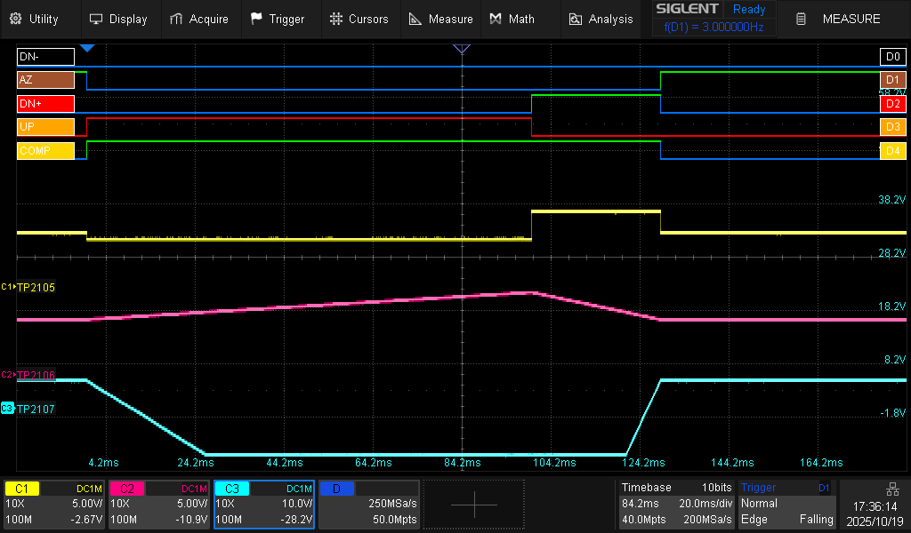
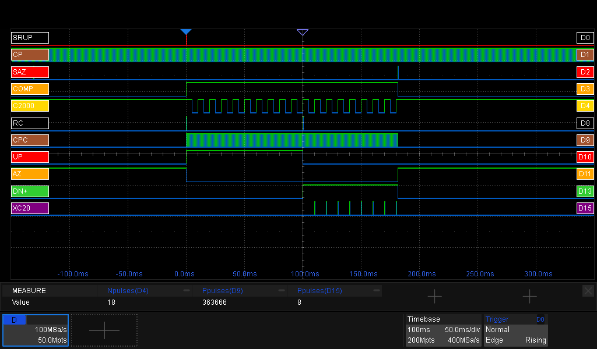
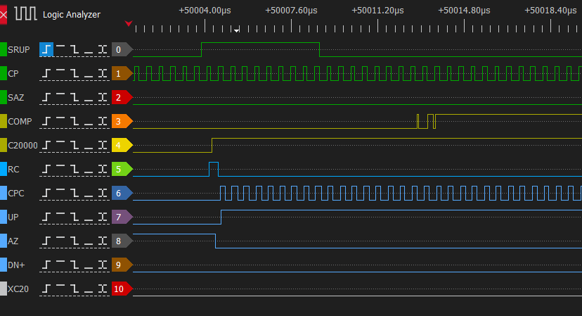
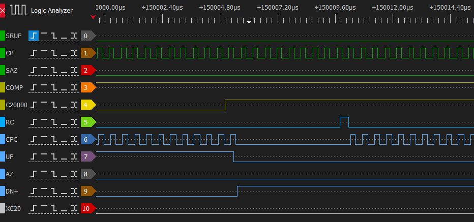
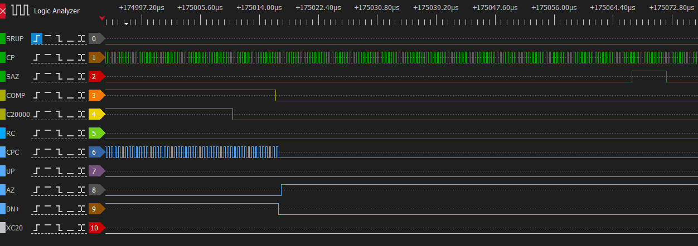

# The ADC: Dual-Slope Precision from Discrete Parts
At the heart of the PM2528 is a **dual-slope integrating ADC**, a method widely used in precision multimeters of this era for its excellent noise rejection and accuracy. Unlike modern designs that use a single-chip ADC, the PM2528 implements most of this function across two full circuit boards.

## The theory
According to Wikipedia, an integrating ADC is a type of analog-to-digital converter that converts an unknown input voltage into a digital representation through the use of an integrator. In this implementation this is performed by a dual-slope converter. In short, it measures voltage by timing how long it takes to discharge a capacitor. It works in two phases: **ramp-up** and **ramp-down**.

#### Ramp-Up (Integration)
First, the unknown input voltage charges an integrator (an opamp with a capacitor in the feedback loop) for a fixed period. The output voltage of this integrator ramps up linearly.

#### Ramp-Down (De-integration)
Then, a known precise reference voltage of opposite polarity is applied, discharging the capacitor. The time required to bring the integrator’s output back to zero is measured. This gives the relationship:

>Vin = (Tdown / Tup) × Vref

Since the integration time (**Tup**) and **Vref** are fixed and stable, measuring **Tdown** gives an accurate representation of the input voltage.

## In Practice: how does the PM2528 do this?

Performing a measurement requires four components: The CPU, Expansion boards N20 (ADC Control) and N21 (ADC Core), and a 20.000-count Counter. For understanding how everything works together, the role of every component must be clear.

.

#### The CPU
The CPU is the director of a measurement. It:
- Feeds the clocksignal (**CP**) to the ADC Control
- Commands the ADC Control to start a measurement with **SRUP** (Start Ramp Up) and auto-zero the ADC via **SAZ**(Set Auto Zero)
- Counts Counter-overflows through **C2000** pulses.
- Reads the final count-value from the Counter (**Count**) when the measurement finishes

#### Board N20 (ADC Control)
This board forms the digital control interface between the microcontroller, the ADC core and the Counter. Its functions include:
- Sends control signals like **AZ** (Auto Zero), **UP**/**DN+**/**DN-** (Ramp UP, DowN for positive resp negative input voltages)
- Generate the **CPC** (Clock Pulse Counter) signal for the Counter, which is just **CP** gated by **COMP**
- Resets the Counter via the **RC** (Reset Counter) pulse

#### Board N21 (ADC Core)
Here lies the analog heart of the converter:
- Signal Input Path: Receives scaled signals from the analog front-end
- Reference Voltage: Provides stable reference for de-integration phase
- Auto-Zeroing: Ensures measurement accuracy by compensating for offset voltages. It is triggered by the **AZ** signal from the ADC Control.
- Integrator: An op-amp and capacitor form the core integration circuit
- Comparator: Detects when the integrator output crosses zero
- Generate the **COMP** signal which indicates the ADC core is still busy (the name is probably short for COMPuting or COMPerator)

#### The Counter
Simple but essential: the Counter just counts pulses. It gets a clock pulse (**CPC**) from the ADC Control. When it overflows, it raises **C20000**. These pulses are counted by the CPU.

# A Measurement Cycle in action
Let’s walk through a full measurement cycle, based on scope captures and logic traces. We'll do this top-down, so first an overview, then the details.

_Note: In the images below, the analogue traces are offset by +5V. That's because the digital 0V is -5V in reference to the analogue 0V. As a scope knows just one 0V (GND)._

The screencapture below shows a full ADC-cycle. The input voltage is about 1.63V DC, the meter is in 2V range. The digital signals (top of the screen) are the signals as seen from the CPU's point of view.

.

#### @0ms: start of the cycle
- The CPU releases the **AZ** signal. The other circuits are now able to accept measurement-signals
- The CPU sets the **UP** signal. This initiates the 'Ramp-Up' phase.
- The CPU leaves the **DN+** and **DN-** signal low, indicating no 'Ramp-Down' phase.
- The input-signal is offered to the ADC (**TP2105**, yellow trace)
- The ADC (**TP2106**, purple trace) starts integrating
- The **COMP** signal is asserted by the ADC, meaning it's working hard

#### @100ms: The fixed time Ramp-Up phase is ready
- The **UP** signal is reset
- The **DN+** signal is set, meaning we're starting the Down-Ramp phase
- The measurement-signal (**TP2105**, yellow trace) is set to the reference-voltage, with an opposite sign as the input-signal
- The ADC (**TP2106**, purple trace) starts draining
- The **COMP** signal stays high, as the ADC is still working.

#### @180ms: Measurement ready
- The ADC has is crossing zero, meaning we're ready.
- The CPU asserts **AZ** indicating 'zero everything'
- **DN+** is reset, indicating we're done with the Ramp-Down phase
- The measurement-signal (**TP2105**, yellow trace) is set to 0V
- The **COMP** signal is reset by the ADC, indicating is resting now.

### A second example
When you offer a small voltage (but in the same measurement range), the Ramp-down phase will be shorter as the ADC won't be charged up as much in the Ramp-Up phase. See the image below.

.

# A measurement Cycle in detail

_Todo - not correct, make new screenshots_

Timing accuracy is crucial in a dual-slope converter. The CPU provides a 2 MHz clock (labeled CP) used by the control logic. All measurement intervals are derived from this base clock. With a known time base, the measurement reduces to counting pulses.

.

### Phase 1: Ramp-Up (Integration)
The measurement begins when the CPU asserts the SRUP signal (Start Ramp Up).

The ADC Control resets the 20,000-count counter (RC = Reset Counter)

Clock pulses (CPC) begin driving the counter

AZ is released, disabling auto-zeroing and allowing the integrator to start

UP is asserted, directing the ADC Analog to integrate the input voltage

Once the comparator detects voltage, it asserts the COMP signal

The integration period is fixed: 200,000 clock pulses, exactly 100 ms at 2 MHz. During this time, the input voltage charges the integrator’s capacitor linearly.

Interestingly, the COMP signal doesn’t activate immediately. There’s a slight delay, likely due to residual offset or incomplete zeroing at the comparator input. Time to calibrate.

.

During ramp-up, the counter tracks every CPC pulse. For every 20,000 counts, the carry-out (C20000) toggles. The ADC Control logic uses this to track progress toward the 200,000-pulse goal. Once ten carry pulses have been seen, the ramp-up phase ends.

At this point, the capacitor holds a charge proportional to the input voltage.

### Phase 2: Ramp-Down (de-integration)
Now comes the clever part. The integrator is discharged using a fixed reference current, and the time it takes to return to zero is measured.

The UP signal is deasserted
The DN+ (or DN-, depending on input polarity) is asserted to begin ramp-down
The counter is reset again via RC
The CPU counts how many times the counter hits 20,000 using the XC20 signal

.

This continues until the comparator detects zero crossing, at which point COMP goes low again. The ADC Control:

Halts the counter by stopping the CPC clock
Resets the DN± signal
Re-asserts AZ to begin a new auto-zero cycle
The CPU pulses the SAZ signal to be sure the auto-zero, to make sure the auto-zero cycle starts. Probably to mitigate a failed measurement.

.

At this point, the measurement is complete.

Now the CPU needs to calculate the input voltage, based on the number of pulses counted during the Ramp-Down phase.

In this example (see the measurement-pane in the image below):

Ramp-up phase = 200.000 counts
Ramp-down phase = 363.666-200.000=163.666 counts (=8x20.000 from XC20 + 3.666 from the counter)
Reference-voltage = 2V (see the schematics in the Github-repository)
Vin = (Tdown / Tup) × Vref = 163.666 / 200.000 * 2V = 1,63666V

