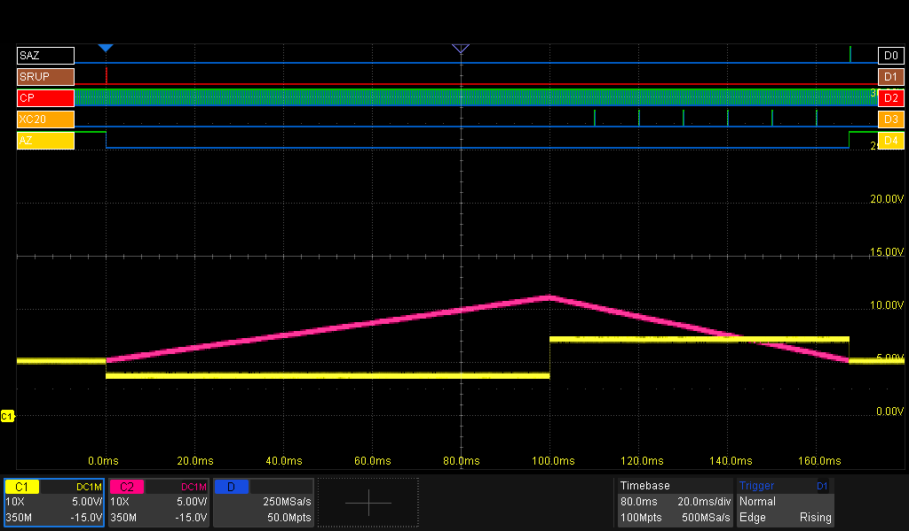
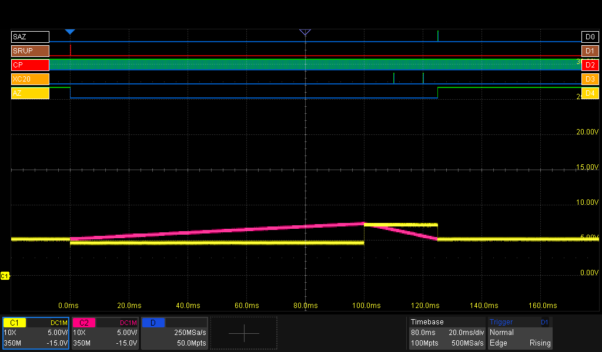

# The ADC: Dual-Slope Precision from Discrete Parts
At the heart of the PM2528 is a **dual-slope integrating ADC**, a method widely used in precision multimeters of this era for its excellent noise rejection and accuracy. Unlike modern designs that use a single-chip ADC, the PM2528 implements most of this function across multiple components on multiple modules.

## The theory
An integrating ADC is a type of analog-to-digital converter that converts an unknown input voltage into a digital representation through the use of an integrator. In this implementation this is performed by a dual-slope converter. In short, it measures voltage by timing how long it takes to discharge a capacitor. It works in two phases: **ramp-up** and **ramp-down**.

#### Ramp-Up (Integration)
First, the unknown input voltage charges an integrator (an opamp with a capacitor in the feedback loop) for a fixed period. The output voltage of this integrator ramps up linearly.

#### Ramp-Down (De-integration)
Then, a known precise reference voltage of opposite polarity is applied, discharging the capacitor. The time required to bring the integrator’s output back to zero is measured. This gives the relationship:

>Vin = (Tdown / Tup) × Vref

Since the integration time (**Tup**) and **Vref** are fixed and stable, measuring **Tdown** gives an accurate representation of the input voltage.

## In Practice: how does the PM2528 do this?

Performing a measurement requires four components of the machine: The CPU, module ADC Control, module ADC Analog and a 20.000-count Counter. For understanding how everything works together, the role of every component must be clear.

#### Input
This is the voltage to be measured. For this section, assume this voltage has been scaled down to normalized voltage levels, ready for processing.

#### The CPU
The CPU is the director of a measurement. It is in control of the clocksignal, gives a start-signal to the ADC-Control and reads the counter, among other things.

#### ADC Control (Expansionboard N20)
This board forms the digital control interface between the microcontroller, the ADC Analog and the Counter. The ADC Control is normaly 'idle', unless commanded by the CPU to perform a measurement.

#### ADC Analog (Expansionboard N21)
Here lies the analog heart of the converter. This board provides a reference voltage for the de-integration phase and contains all analog logic for the dual slope integration process.

#### The Counter
The 20.000 counts Counter just counts pulses, provided by the ADC Control. In return, it provides the actual count-value to the CPU.

### The signals
The signals used/shown on this page (see also the image above):
| Signal | Use | Source | Target |
| - | - | - | - |
| **SRUP** | Start Ramp-Up | CPU | ADC Control |
| **SAZ** | Set Auto Zero | CPU | ADC Analog |
| **CP** | Clock Pulses | CPU | ADC Analog |
| **XC20** | Counter overflow (20.000 counts) @ RampDown | ADC Control | CPU |
| **Count** | Current value | Counter | CPU |
| **yellow trace** | Input to ADC Integrator | Signal conditioning | ADC Analog |
| **purple trace** | ADC Integrator | ADC Analog | ADC Analog |

## A Measurement Cycle from the CPU's perspective
Let’s walk through a full measurement cycle, based on scope captures and logic traces.

_Note: In the images below, the analogue traces are offset by +5V. That's because the digital 0V is -5V in reference to the analogue 0V and this is the way to show two signals in one screenshot (apart from Photoshop)._

The screencapture below shows a full ADC-cycle. The input voltage is about 1351mV DC, the meter is in 2V range. The digital signals (top of the screen) are the signals as seen from the CPU's point of view.

#### @0ms: start of the cycle
- The CPU sets the **SRUP** signal. This initiates the 'Ramp-Up' phase.
- The input-signal (**yellow trace**, reverse polarity, why?) is offered to the ADC
- The **AZ** signal is set low by the ADC-control, indicating there's no auto-zeroing going on.

#### @0-100ms: Ramp-up phase
- The ADC (**purple trace**) is integrating
- As this is a fixed time phase, under control of the ADC Control, the CPU does not receive any signal. Note there are no timer-overflow (**XC20**) pulses.
- Watch the clockpulses (**CP**) pulsing

#### @100ms: The fixed-time Ramp-Up phase is finished
- The measurement-signal (**yellow trace**) is set to the reference voltage (opposite polarity of the input voltage)

#### @100-170ms: Ramp-down phase
- The ADC (**purple trace**) keeps draining due to the reference voltage
- Every 20.000 pulses of the clock, the CPU receives the Counter Overflow pulse (**XC20**). The CPU counts the number of these pulses.

#### @170ms: Measurement ready
- The ADC (**purple trace**) has crossed zero, meaning we're ready. The CPU knows this, because the AutoZero signal (**AZ**) has been set by the ADC Control.
- The CPU asserts **SAZ** telling the ADC Control to auto-zero.
- The input signal to the ADC (**yellow trace**) is reset to 0V.

#### Displaying the measured value
The CPU now calculates the measured value, using
- the current value of the Counter
- the number of **XC20** pulses
- Ramp-up phase = 200.000 counts (=fixed)
- Ramp-down phase = 135.100 counts (=6 x 20.000 from **XC20** + 15.100 from the Counter)
- Reference-voltage = 2000mV
>Vin = (Tdown / Tup) × Vref = (135.100 / 200.000) * 2000mV = 1351mV

### A second example
When you offer a small voltage (but in the same measurement range), the Ramp-down phase will be shorter as the ADC won't be charged up as much in the Ramp-Up phase. See the image below for a measurement of 500mV.

### High-speed mode
In high-speed mode (can only be enabled via the GPIB-interface) the ramp-up phase is reduced from 200.000 counts to 20.000 counts, eg, 10 times faster.