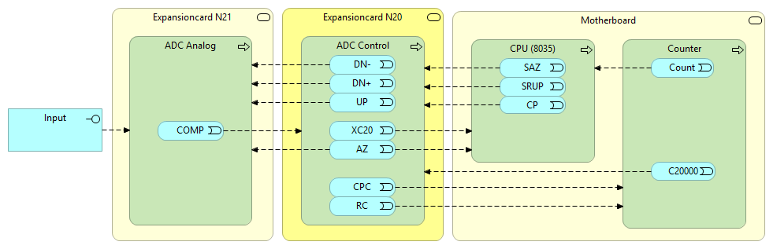
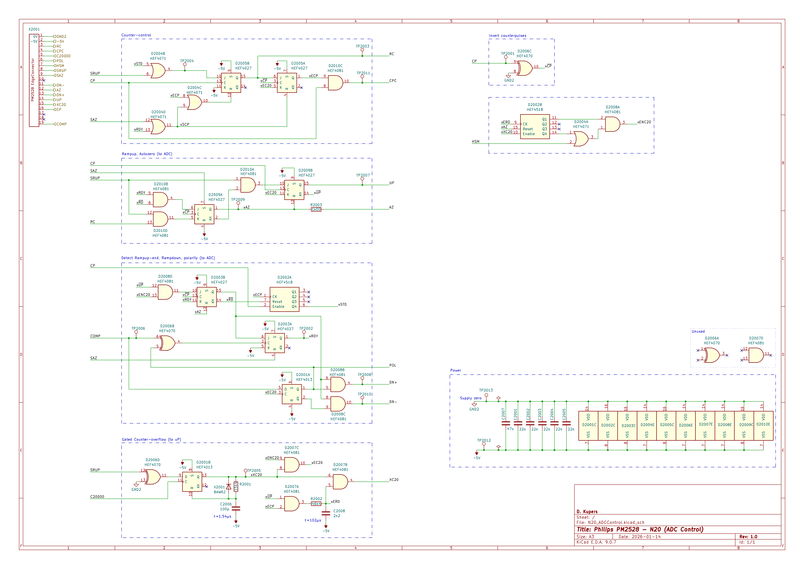
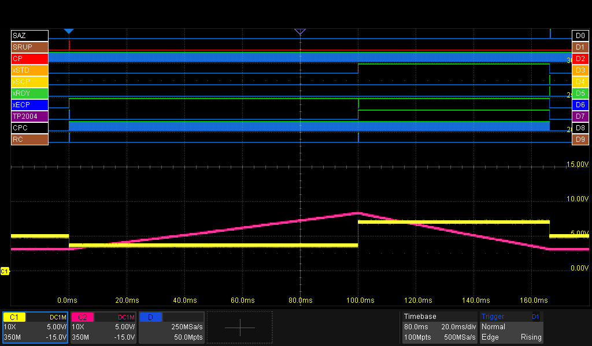
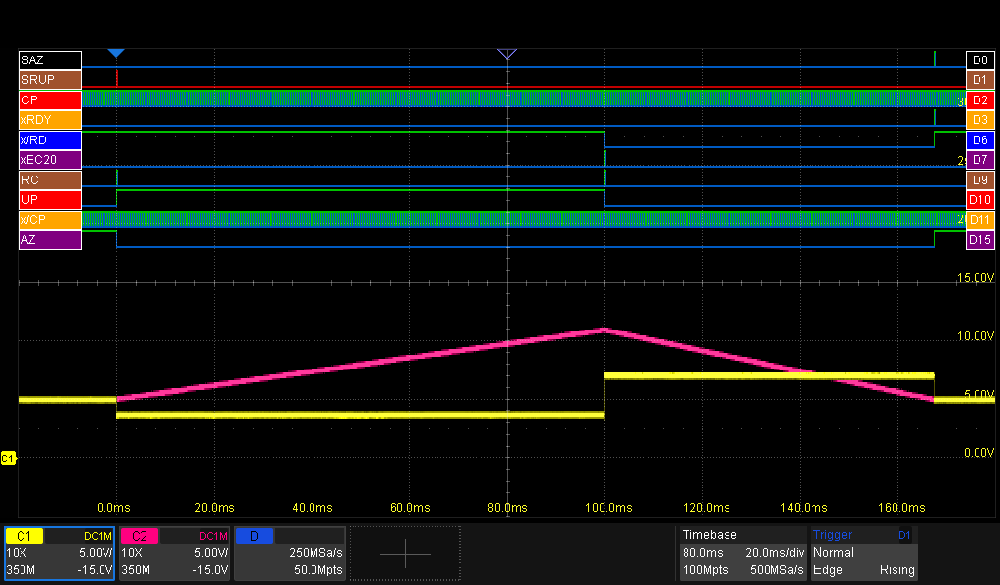
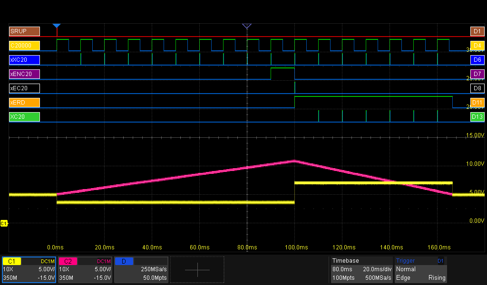
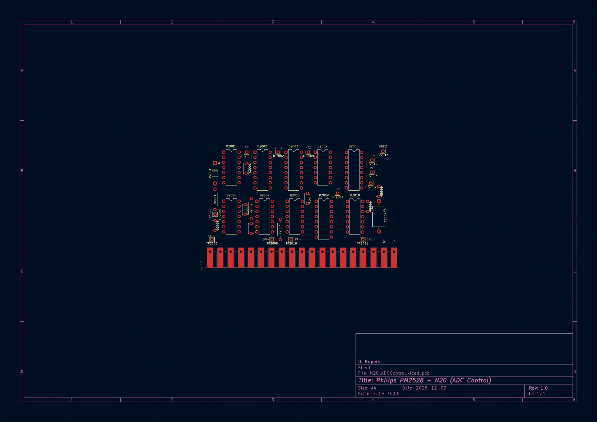
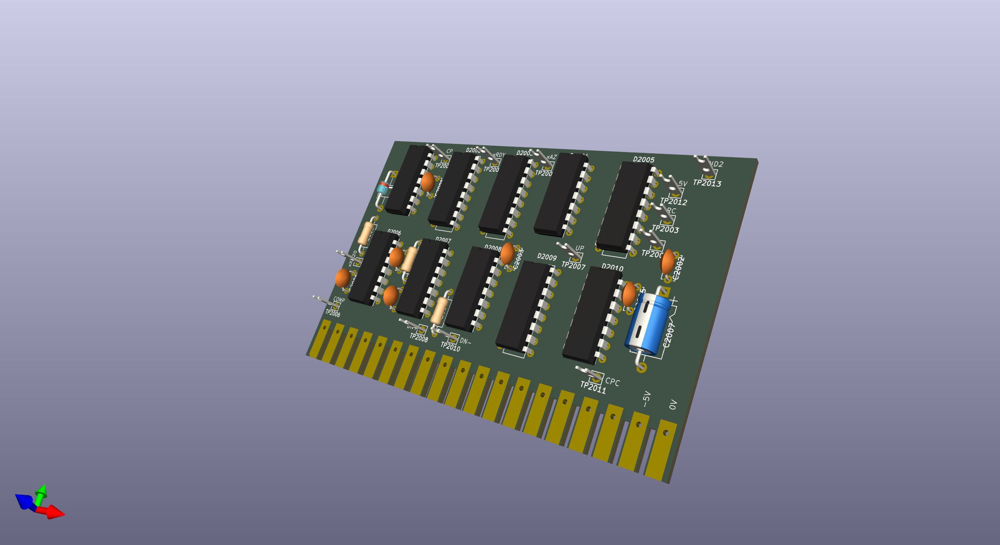

# ADC Control (Expansionboard N20)
This expansion board forms the digital control interface between the microcontroller, the ADC Analog and the Counter.

Its functions include:
- Coordinating of the Ramp-Up and Ramp-Down phases
- Send the correct signals on time to the ADC Analog
- Trigger and reset the Counter
- Return measurement-ready signal to the CPU

### The signals
The signals used/shown on this page (see also the image above):
| Name | Description | I/O | Target | I/O Pin | Testpoint |
| - | - | :-: | - | -: | - |
| **SRUP** | Start Ramp-Up | I | CPU | 8 |
| **SAZ** | Set Auto Zero | I | CPU |9 |
| **CP** | Clock Pulses | I | CPU | 16 | TP2001 |
| **DN-** | RampDown phase, for -pol input signals | O | ADC Analog | 11 | TP2010 |
| **DN+** | RampDown phase, for +pol input signals | O | ADC Analog | 13 | TP2008 |
| **UP** | RampUp phase | O | ADC Analog| 14 | TP2007 | 
| **XC20** | Counter overflow (20.000 counts) @ RampDown | O | CPU | 15 |
| **AZ** | AutoZero active? | O | ADC Analog, CPU | 12 |
| **COMP** | COMPuting (integrator busy) | I | ADC Analog | 19 | TP2006 |
| **C20000** | Counter overflow (20.000 counts) | I | Counter | 5 |
| **CPC** | ClockPulses for Counter | O | Counter | 4 | TP2011 |
| **RC** | Reset Counter | O | Counter | 3 | TP2003 |

In the scope-screendumps, you'll also see these signals:
| Trace | Description | Measuring point |
| - | - | - |
| **yellow** | Input into ADC Integrator | N21.TP2105 |
| **purple** | ADC Integrator voltage | N21.TP2106 |

## A Measurement Cycle from the ADC Control's perspective

This section describes in detail how the N20 takes it role as the conductor of a measurement. The next image shows an overview, including the most important signals.

_Note: In the images below, the analogue traces are offset by +5V. That's because the digital 0V is -5V in reference to the analogue 0V and this is the way to show two signals in one screenshot (apart from Photoshop)._

#### @0ms: start of the cycle

- The measurement starts with a **SRUP**-pulse from the CPU
- The ADC Control resets the counter via **RC**. The counter resets and sets the **C20000** signal high (it's active low)
- The ADC Control opens the gate for the **CP** signals to passthrough to the Counter via the **CPC** signal.
- The ADC Control raises the **UP** signal, which instructs the ADC Analog to select the input-signal (reverse polarity) to be selected.
- The **AZ** signal is set low by the ADC-control, indicating there's no auto-zeroing going on.
- The ADC Analog signals the ADC Analog it's integrating, by setting the **COMP** signal.

#### @0-100ms: Ramp-up phase
See the first image in this section for reference.
- The Counter is busy counting, clocked by the **CPC** pulses.
- The Counter sends the **C20000** pulses to indicate it overflows. As the Ramp-Up phase is a fixed time phase, the ADC Control swallows them.
- Watch the clockpulses (**CP**) pulsing
- The ADC (**purple trace**) is integrating

#### @100ms: The fixed-time Ramp-Up phase is finished, starting the Ramp-Down phase
(please add 100ms to the time in the image)

- The ADC Control detected that the Ramp-Up phase has finished, as it has counted 200000 **CP** pulses.
- The ADC Control resets **UP** to signal the ADC Analog Ramp-Up is finished.
- The ADC Control sets **DN+** to indicate the ADC Analog we're now starting the Ramp-Down phase. The ADC Analog selects the positive reference-signal for de-integrating. For negative measure-signals, the ADC Analog would set **DN-** (not pictured).
- The ADC Control resets the counter via **RC**. The counter resets and sets/keeps the **C20000** signal high (it's active low).

#### @100-170ms: Ramp-down phase
See the first image in this section for reference.
- The ADC (**purple trace**) keeps draining
- For every counter-overflow (rising edge of **C20000**), the ADC Control sends a pulse to the CPU (**XC20**).

#### @170ms: Measurement ready

- The ADC Analog detected that de-integrating is ready by resetting the **COMP** signal.
- The ADC Control then resets the **DN+** signal
- The ADC Control closes the gate for the **CPC** signal, stopping the Counter.
- The ADC Control asserts the **AZ** signal, signalling the CPU it's job has been done and signaling the ADC Analog to select 0V (**yellow trace**) as input to the ADC logic.

The CPU has enough info to calculate the voltage of the input-signal:
- the current value of the Counter
- Multiply the number of **XC20** pulses by 20.000
- Ramp-up phase = 200.000 counts (=fixed)
- Ramp-down phase = 135.100 counts (=6 x 20.000 from **XC20** + 15.100 from the Counter), which should be the same as the nummber of pulses **CPC**
- Reference-voltage = 2000mV
>Vin = (Tdown / Tup) × Vref = (135.100 / 200.000) * 2000mV = 1351mV

## Schematics
I copied and rearranged the schematics and PCB in KiCad, using the low‑res Philips docs as a reference. There might be a few small differences since I tweaked them to match my PM2528. You’ll find the KiCad files in other parts of this repo.

The input- and output signals of this board are listed at the top of the page. The 'local' signals are listed in the next table.

| Name |  Description | Testpoint |
| - | - | - |
| **x/CP** | **C**lock**P**ulse (inverted)  | |
| **xSTD** | **ST**art Ramp**D**own? | |
| **xECP** | **E**nable **C**ounter**P**ulses (to counter)| |
| **x/RD** | ? | |
| **xRDY** | **R**ea**DY**: RampUp and RampDown finished | TP2002 |
| **xSCP** |  **S**top **C**ounter**P**ulses | |
| **xEC20** | Pulse (≈1.40us) when ending RampUp | |
| **xENC20** |  ? | |
| **xEC20** | **E**nable **C20000** gate | |
| **xXC20** | Pulse (≈1.40us) for every Counter overflow  | TP2005 |
| **xERD** | **E**nable **R**amp**D**own gate (XC20->uP), delayed by ≈40us | |
| **xSTD** | ? | |
| **xAZ** | AutoZero active (same as **AZ**) | TP2009 |
| **x/UP** | Ramp**UP** active (inverted)

### Section: Counter-control
This section generates the **CPC** (ClockPulses for Counter) and **RC** (Reset Counter) signals.

### Section: Signals for ADC: RampUp, AutoZero
This section generates the **UP** (RampUp active) and **AZ** (AutoZero) signals.

The **UP** (RampUp) signal is active during the RampUp phase.
The **AZ** (AutoZero) signal is active when the measurement is not active, eg, when not in the RampUp or RampDown phase.

### Section: Signals for ADC: Polarity and RampDown
This section generates the **POL** (Polarity), **DN+** and **DN-** (DownRamp) signals.

### Section: Gated Counter-overflow
This section creates the **XC20** signal for the CPU. This is in fact a gated Counter-Overflow signal. The gate is closed in the RampUp phase, and opened in the RampDown phase.

### Section: Invert counterpulses
Just a simple inverter.

### Section: ?
This section generates the internal **xENC20** signal.

## PCB

