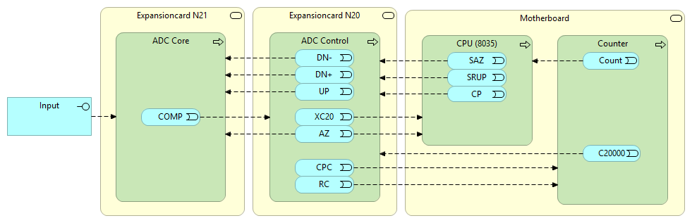
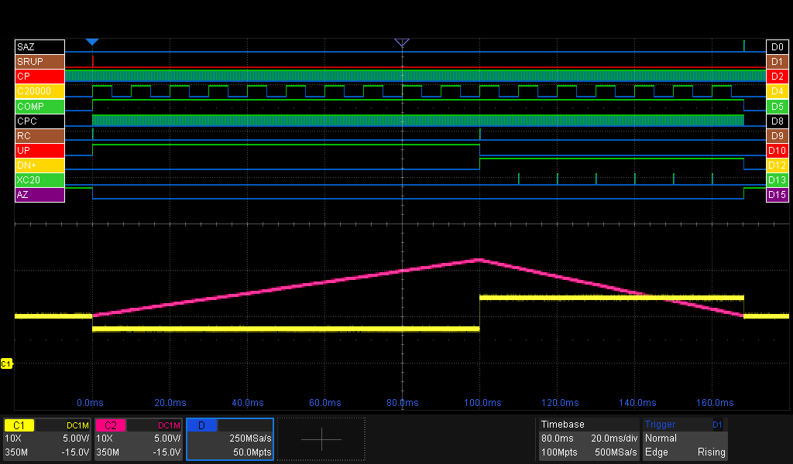
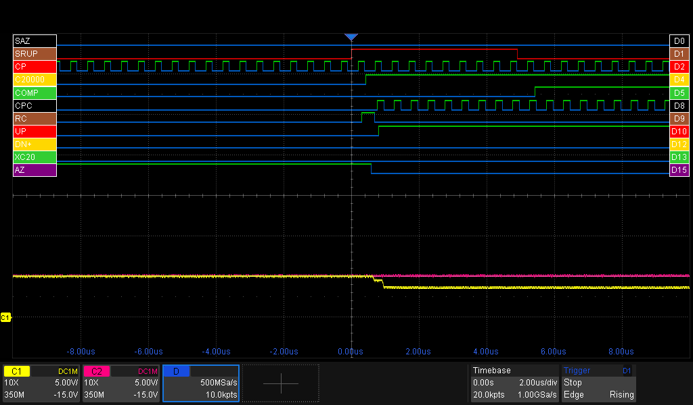
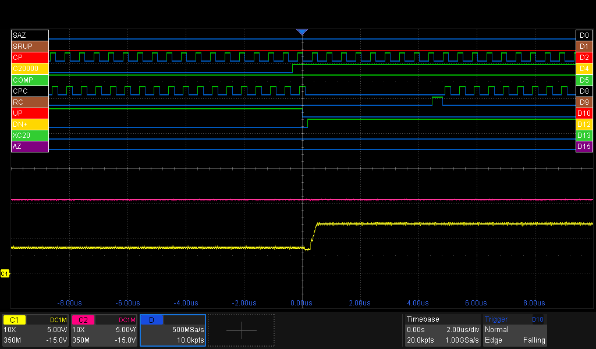
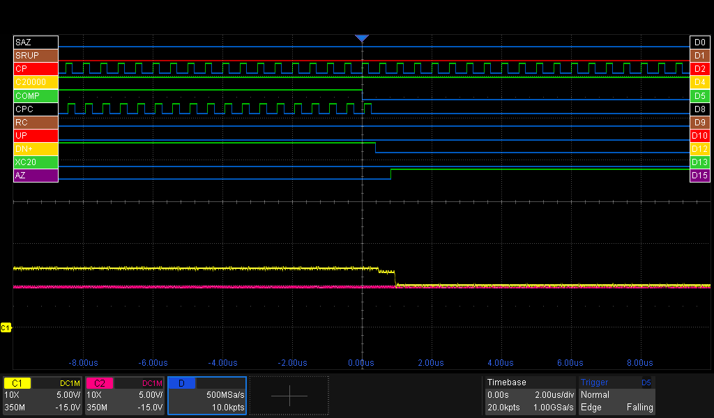

# N20: ADC Control
This expansion board forms the digital control interface between the microcontroller, the ADC core and the Counter.

Its functions include:
- Send control signals like AZ (Auto Zero), UP/DN+/DN- (Ramp UP, DowN for positive resp negative input voltages)
- Generate the CPC (Clock Pulse Counter) signal for the Counter, which is essentially CP gated by COMP
- Counts Counter-overflows through C2000 pulses, sends them to the CPU (XC20)
- Resets the Counter via the RC (Reset Counter) pulse

# A Measurement Cycle from the N20's perspective

This section describes in detail how the N20 takes it role as the conductor of a measurement. The next image shows an overview, including the most important signals. Not in this image are:
- **POL**: Polarity of the signal
- **DN-**: Start of Ramp-Down for negative-polarity signals
- **HSM**: Indication this will be a high-speed measurement

#### @0ms: start of the cycle

- The measurement starts with a **SRUP**-pulse from the CPU
- The ADC Control resets the counter via **RC**. The counter resets and sets the **C20000** signal high (it's active low)
- The ADC Control opens the gate for the **CP** signals to passthrough to the Counter via the **CPC** signal.
- The ADC Control raises the **UP** signal, which instructs the ADC Core to select the input-signal (reverse polarity) to be selected.
- The **AZ** signal is set low by the ADC-control, indicating there's no auto-zeroing going on.
- The ADC Core signals the ADC Core it's integrating, by setting the **COMP** signal.

#### @0-100ms: Ramp-up phase
See the first image in this section for reference.
- The Counter is busy counting, clocked by the **CPC** pulses.
- The Counter sends the **C20000** pulses to indicate it overflows. As the Ramp-Up phase is a fixed time phase, the ADC Control swallows them.
- Watch the clockpulses (**CP**) pulsing
- The ADC (**purple trace**) is integrating

#### @100ms: The fixed-time Ramp-Up phase is finished, starting the Ramp-Down phase
(please add 100ms to the time in the image)

- The ADC Control detected that the Ramp-Up phase has finished, as it has counted 200000 **CP** pulses.
- The ADC Control resets **UP** to signal the ADC Core Ramp-Up is finished.
- The ADC Control sets **DN+** to indicate the ADC Core we're now starting the Ramp-Down phase. The ADC Core selects the positive reference-signal for de-integrating. For negative measure-signals, the ADC Core would set **DN-** (not pictured).
- The ADC Control resets the counter via **RC**. The counter resets and sets/keeps the **C20000** signal high (it's active low).

#### @100-170ms: Ramp-down phase
See the first image in this section for reference.
- The ADC (**purple trace**) keeps draining
- For every counter-overflow (rising edge of **C20000**), the ADC Control sends a pulse to the CPU (**XC20**).

#### @170ms: Measurement ready

- The ADC Core detected that de-integrating is ready by resetting the **COMP** signal.
- The ADC Control then resets the **DN+** signal
- The ADC Control closes the gate for the **CPC** signal, stopping the Counter.
- The ADC Control asserts the **AZ** signal, signalling the CPU it's job has been done and signaling the ADC Core to select 0V (**yellow trace**) as input to the ADC logic.

The CPU has enough info to calculate the voltage of the input-signal.