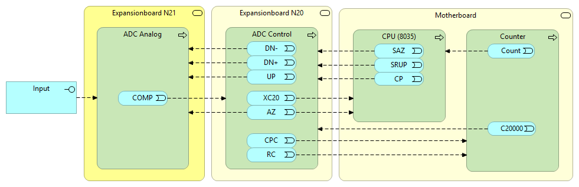
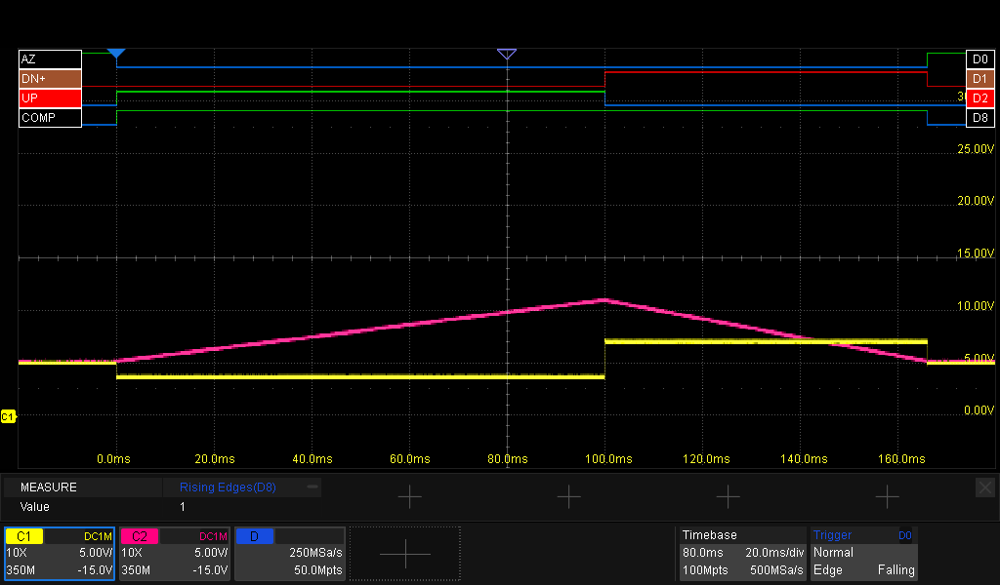
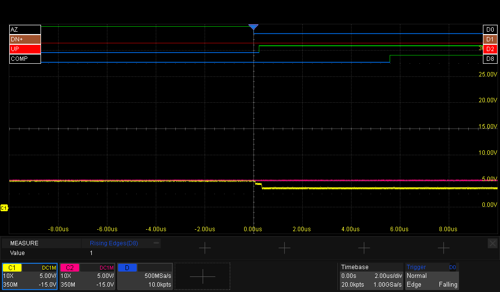
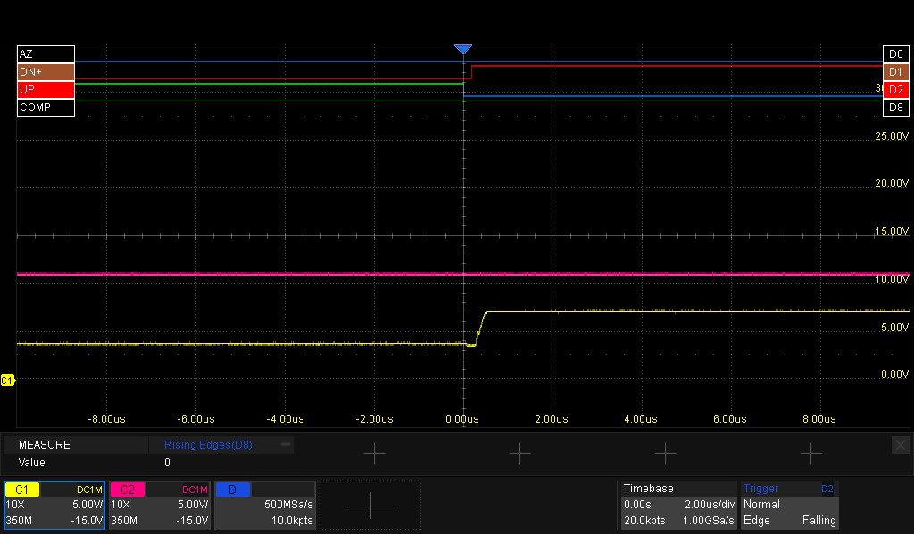
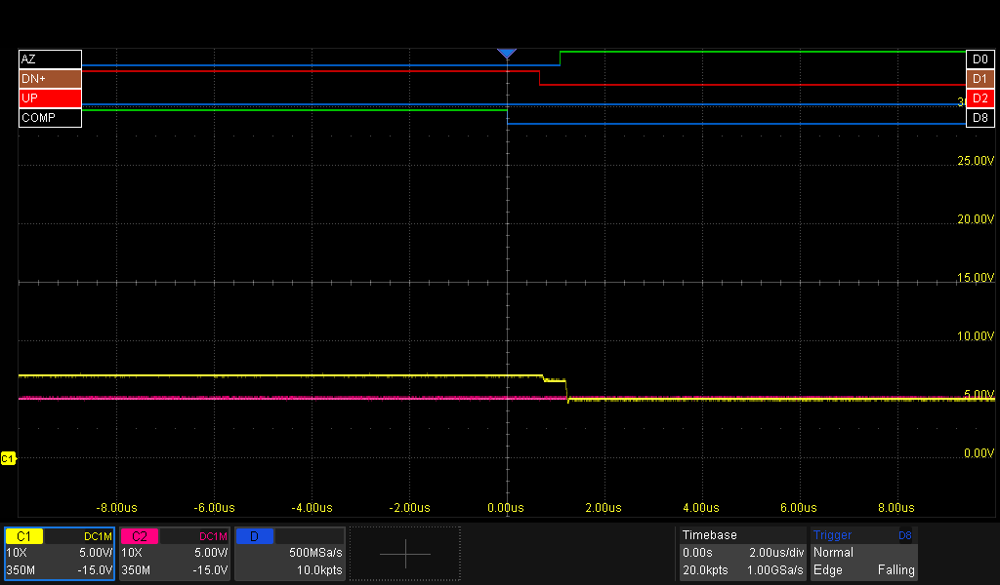

# ADC Core (Expansionboard N21)

# A Measurement Cycle from the ADC Core's perspective

This section describes in detail how the N20 takes it role as the conductor of a measurement. The next image shows an overview, including the most important signals. Not in this image is:
- **DN-**: Start of Ramp-Down for negative-polarity signals

#### @0ms: start of the cycle

- The measurement starts with the **AZ**-signal from the ADC Control. This 'releases' the zero-clamping and offset-correcting circuits.
- After this, the ADC Control signals the ADC Core to start the RampUp-phase by setting the **UP** signal.
- The integrator starts integrating (**purple trace**)

#### @0-100ms: Ramp-up phase
See the first image in this section for reference.
- The ADC selects the input-signal to be fed into the integrator (**yellow trace**)
- The integrator keeps integrating (**purple trace**)
- The integrator on the ADC Core sees a non-zero signal and raises **COMP**.

#### @100ms: The fixed-time Ramp-Up phase is finished
(please add 100ms to the time in the image)

- The ADC Control releases the **UP** signal as the fixed time has passed.
- The ADC Core sets the **DN+** signal to tell the ADC Core it can start the Ramp-Down phase.
- As a response, the ADC Core now selects the correct Reference Signal (**yellow trace**), in this case +2V.
- The integrator now start to drain the capacitor (**purple trace**).

#### @100-170ms: Ramp-down phase
See the first image in this section for reference.
- The integration-capacitor (**purple trace**) keeps draining

#### @170ms: Measurement ready

- The ADC Core detects de-integrating is ready (the capacitor-voltage crosses zero) and resets the **COMP** signal.
- The ADC Control release the **DN++** signal, telling the ADC Control to stop the Ramp-down phase.
- The ADC Core deselects the reference-signal from the integrator-input
- The ADC Control sets the **AZ** signal, the ADC Core initiates the Auto-zero circuitery.

Ready!