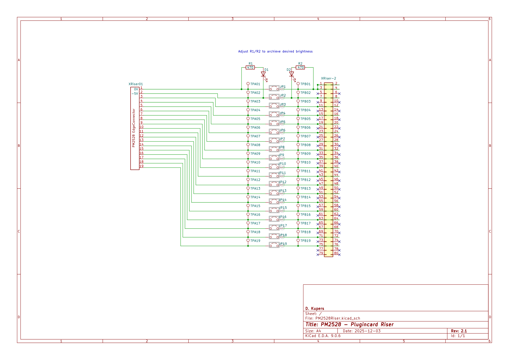
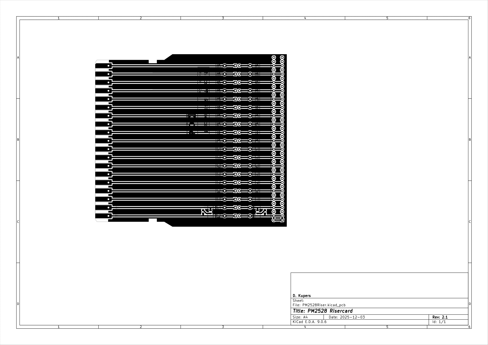
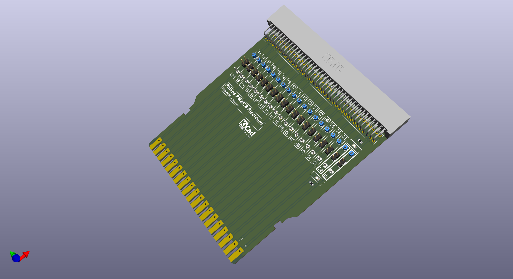
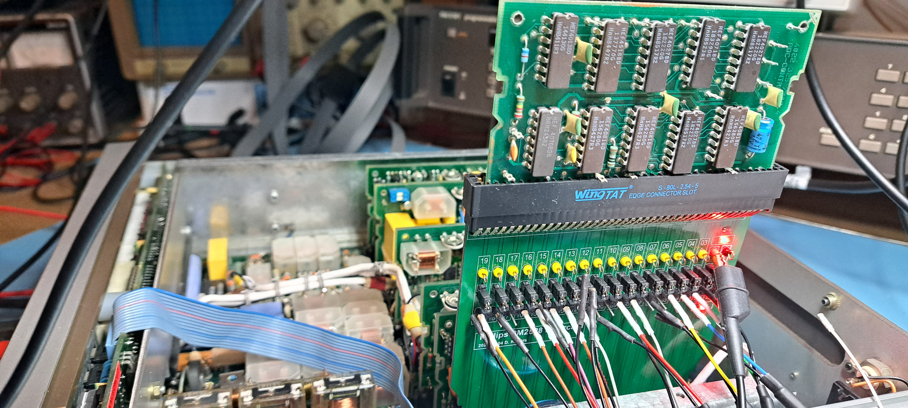

# Risercard
Testing the expansion boards isn’t exactly convenient. They’re packed in tight, so probing components is a hassle. Pulling a board out gives you access, but wiring up all the signals is basically impossible. The fix was straightforward: I built a simple riser card

It’s got a few handy features:
- Works in any expansion slot, except the ones reserved for the Galvanic Isolation board (N30) and the IEEE488 board (N32).
- Power LED to show there’s juice (0V/‑5V) coming from the PM2528 into the riser.
- Another power LED to confirm that same juice is actually reaching the “rised” board.
- Jumpers to break all 19 signals going to and from the board.
- Pin headers so you can tap or inject those 19 signals.
- Test pins for the same job, if you prefer a quick probe.

## Schematics and PCB

